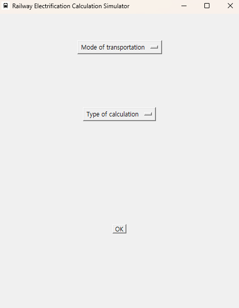
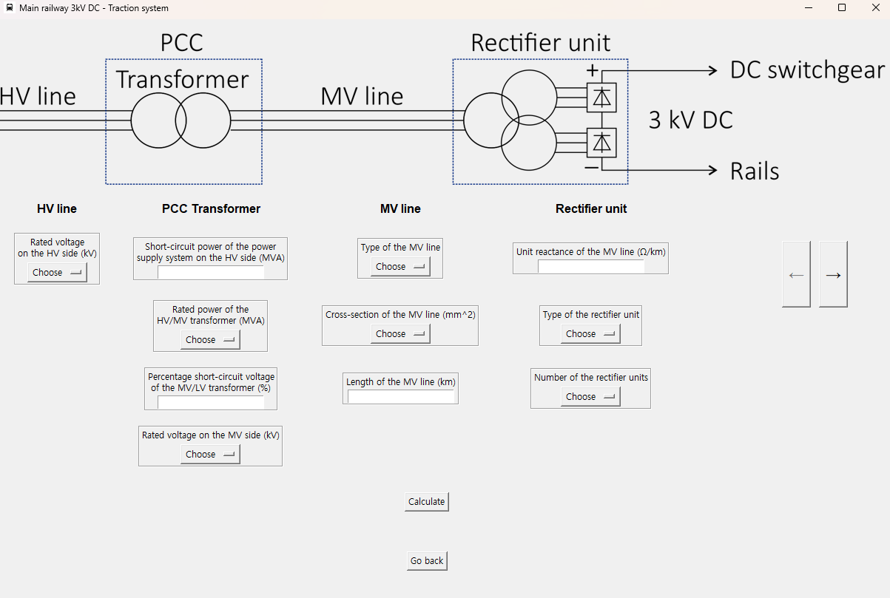
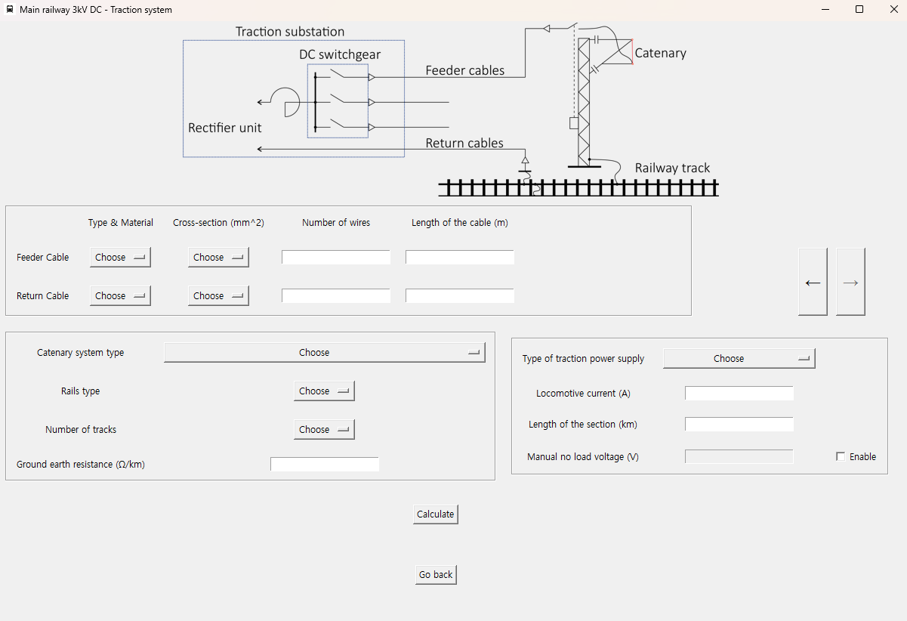
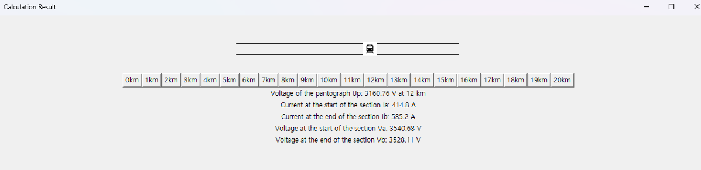

# RECS (Railway Electrification Calculation Simulator)

## Virtual Simulator for DC Traction Power Supply System

## Overview
The **Virtual Simulator for Analysis of Voltage Drops and Short Circuits in the DC Traction Power Supply System** is a Python-based software developed to simulate the electrical behavior of a **3 kV DC traction system**. This program allows users to analyze various railway electrification parameters, including:

- **Voltage drops** in traction networks.
- **Substation performance** under different operating conditions.
- **Short-circuit scenarios** to evaluate system faults and responses.
- **Current distribution** across different traction power supply configurations.

The simulator was initially developed as part of a **bachelor’s thesis at Warsaw University of Technology**, aiming to modernize railway electrification studies by replacing traditional physical laboratory experiments with a flexible digital environment.

#### If you would like to have a look at the thesis itself, it is uploaded as Virtual_Simulator_DC_Traction_Seunghyun_Yoo_2024.pdf [Virtual_Simulator_DC_Traction_Seunghyun_Yoo_2024 (PDF)](Virtual_Simulator_DC_Traction_Seunghyun_Yoo_2024.pdf) 😄


---

## Features
- **Graphical User Interface (GUI):** Developed using Python's **Tkinter** for intuitive navigation.
- **Multiple Simulation Modes:**
  - Substation analysis
  - Voltage drop analysis
  - Short-circuit simulation
- **Customizable Parameters:** Define key traction system variables such as cable type, substation power, voltage levels, and more.
- **Real-time Calculations:** Instant results for voltage, current, and power characteristics.
- **Error Handling:** Input validation and user-friendly error messages.

---

## Installation and Setup

Download the zip of this repository and run RECS.EXE 🚀

or if you want to run the code itself, please follow below

### Prerequisites
Ensure you have the following installed on your system:

- **Python (3.x)**
- Required Python libraries:
  ```sh
  pip install pillow
  ```

### Running the Program
1. Download the program files.
2. Open a terminal or command prompt in the project directory.
3. Run the main script:
   ```sh
   main.py
   ```
4. The GUI will launch, allowing you to select a simulation mode.

---

## Usage Instructions
1. **Choose the Simulation Mode:**
   - Substation Analysis
   - Traction System Voltage Drop
   - Short-Circuit Analysis
     
     
2. **Enter Required Parameters:**
   - Select from dropdown menus or manually input values. (example of traction system calculation window below)
  
     
     

     
3. **Run the Simulation:**
   - Click the **'Calculate'** button.
  
4. **Analyze Outputs:**
   - View voltage and current values
   - Review calculations
   - Examine the calculated values for different locations of the train by using the km buttons.
  
    

---

## Program Structure
- **Main Window:** Selection of transportation mode and calculation type.
- **Substation Simulator:** Determines power supply characteristics and voltage behavior.
- **Traction System Simulator:** Simulates voltage drops and current distribution.
- **Short-Circuit Simulator:** Calculates fault conditions in a railway network.
- **Error Handling:** Detects incorrect inputs and provides guidance.

---

## Strengths
✅ **Flexible and Customizable:** Modify system parameters to simulate different railway configurations.

✅ **Educational Tool:** Ideal for students and researchers exploring traction power concepts.

✅ **Accurate Calculations:** Incorporates real-world electrical parameters and railway configurations.

✅ **User-Friendly Interface:** Intuitive design with dropdown menus and easy navigation.

✅ **Cross-Platform Compatibility:** Works on Windows, macOS, and Linux.

---

## Weaknesses
❌ **Limited to Single Train Simulations:** Cannot simulate multiple trains interacting with the power network.

❌ **No AC Traction Support:** Currently designed for **3 kV DC** systems only.

❌ **Basic Graphical Interface:** Uses **Tkinter**, which is functional but not visually advanced.

❌ **Simplified Fault Models:** Does not include complex short-circuit propagation effects.

❌ **No Real-Time Dynamic Analysis:** Provides **static** calculations rather than dynamic railway operation modeling.

---

## Future Improvements
To enhance the simulator, future work could include:

- **Multi-Train Simulation:** Simulating multiple trains in a section.
- **Support for AC Railway Systems:** Extending to **25 kV AC** and other voltage levels.
- **Graphical Enhancements:** Using **PyQt** or **Dash** for improved visualization.
- **Expanded Fault Analysis:** Adding complex short-circuit propagation models.
- **Real-Time Simulations:** Implementing continuous power flow analysis.
- **Web-Based Version:** Developing a browser-accessible interface using **Django** or **Flask**.

---

